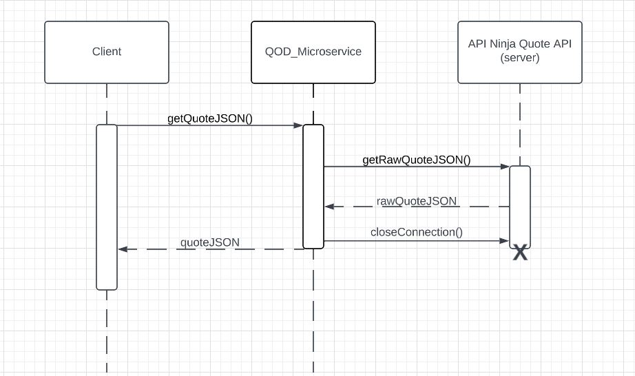

# Description
    This program will utilize the Spring Boot framework to respond to HTTP GET requests
    with a JSON object that contains the quote of the day and the author of the quote
    NOTE: JDK build must be 17 and gradle must be the latest version and you must generate
    your own API key from the API Ninja's quote API for this to work.
# Output
    The contents of the JSON object will contain a QOD ID along with the quote and
    an Author ID along with the author of the quote
# How to use
    To get started, the link to connect/request from is localhost:8080/QuoteOfTheDay where
    8080 is the port you need to use. Then, run the program and send the GET request after
    it has waited a few seconds to initialize. To get another quote, simply refresh the page
# Requesting Data
    To request data from this program, send a HTTP GET request to localhost:8080/QuoteOfTheDay 
    and the program will send a GET request of its own to API Ninja's quote API to receive the 
    necessary information.
# Receiving Data
    To receive the data from this microservice, refer to the page you used to request to where it
    will be displaying the new JSON object with the relevant fields
# UML Sequence Diagram

# Help
    To get help, email me at canns@oregonstate.edu
# Attributions
    Comingupwithnames
